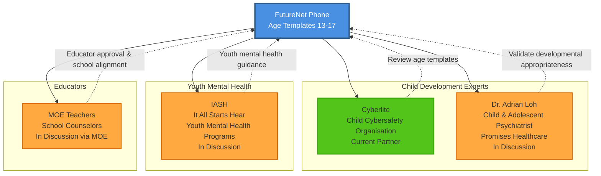

# FutureNet Phone — Pre-Seed Investor Pitch Deck (UPDATED)

**Hybrid Kickstarter + School Pilot Strategy**

---

## Slide 1 — Cover

**FutureNet Phone**

The smartphone that grows with your child — age-appropriate boundaries that update automatically every year

Pre-seed deck — January 2026

---

## Slide 2 — Problem

Singapore parents face an exhausting dilemma:

> "I want my child to be reachable, but I don't want to hand them the entire internet. And I don't want to spend hours every year updating parental controls as they grow."  
> — Parent of 13-year-old, Sec 1

**The problem**:

- **Kids need phones** (logistics, safety, emergencies)
- **But digital boundaries must evolve** as kids mature (13-year-old ≠ 16-year-old)
- **Parents are exhausted** managing this:
  - Reviewing and updating Screen Time settings every year
  - Deciding which apps are age-appropriate
  - Constant negotiations: "Why can't I have Instagram? My friend has it!"
  - Guessing what's developmentally appropriate

**Existing solutions fail**:
- **Mainstream phones + Screen Time**: High parent effort, bypassable, no expert guidance on age-appropriateness
- **"Healthy phones"**: Static policies (same rules at 13 and 16), no graduated access
- **Watches/trackers**: Don't meet teen expectations for a "real phone"

**Result**: Parents either:
1. Give in and hand over a full smartphone (distraction risk, too much too soon)
2. Stress over manual parental control updates every year (exhausting, guesswork)
3. Hold out with no device (safety concerns, logistics friction)

---

## Slide 3 — Parent personas (from Singapore research)

We interviewed 20+ Singapore parents. Three recurring personas:

**The Pragmatist** (40%)
- "I need to reach my child after school, but I don't want them scrolling TikTok in class."
- Wants: reachability + school compliance
- Pain: Screen Time is bypassable; schools won't endorse mainstream phones

**The Safety-First Parent** (35%)
- "What if there's an emergency and I can't reach them?"
- Wants: SOS button, location (opt-in), reliable calls/SMS
- Pain: Watches don't feel like "real phones" to teens; adoption resistance

**The Gradualist** (25%)
- "I want to teach digital responsibility step-by-step, not all-or-nothing. But I don't know what's appropriate at each age."
- Wants: graduated access (start with calls/SMS, add apps over time) with expert guidance
- Pain: No product supports phased autonomy; it's either full smartphone or nothing. And no guidance on what's age-appropriate.

---

## Slide 4 — Solution

**FutureNet Phone**: The smartphone that grows with your child — age-appropriate boundaries that update automatically every year.

**Core value proposition**:

**"Set it once, and we'll update it as your child grows."**

- **Age 13**: Calls/SMS only, no browser, no social media, School Mode during school hours
- **Age 14**: Add messaging apps (parent-approved), basic productivity apps
- **Age 15**: Add educational social media (YouTube with restrictions), maps, music
- **Age 16**: Add broader app access, graduated browser access (safe search enforced)
- **Age 17**: Near-full smartphone experience, preparing for independence

**Every age template is**:
- ✅ **Reviewed by child development experts** (psychologists, digital wellness researchers)
- ✅ **Approved by educators** (teachers, school counselors)
- ✅ **Updated automatically** (no parent effort required)
- ✅ **Customizable** (parents can adjust if needed, but defaults are expert-backed)

**Core features**:

1. **Graduated Access System** (the hero feature)
   - Age-appropriate boundaries that update automatically start of a new school year
   - Expert-reviewed templates for ages 13–17
   - Parents don't need to guess what's developmentally appropriate
   - Reduces parent stress and family conflict

2. **School Mode** (auto-activates during school hours)
   - Locks device to calls/SMS only (whitelisted contacts)
   - No browser, no social media, no games
   - Optional educator override (teacher can unlock for approved use)

3. **Parent-managed device** (Android Enterprise Device Owner)
   - Strong enforcement (not bypassable via VPN, hidden apps, or factory reset)
   - Parent portal to review and customize age templates
   - Override controls if needed (but defaults are expert-backed)

4. **School compliance verifier** (supporting feature)
   - Schools can verify device is policy-compliant (one-click check)
   - School templates for common policies
   - Institutional-grade credibility

5. **SIM-unlocked, parent-owned**
   - Not tied to telco contracts
   - Parents choose carrier and plan
   - Device ownership stays with family

---

## Slide 5 — Why now?

**Convergence of three trends**:

1. **Singapore schools tightening phone policies** (2023–2024)
   - More schools banning smartphones outright
   - Parents asking: "What's the compliant alternative?"

2. **Proven international demand** (US, UK, Japan, Korea)
   - WisePhone (US): $500K+ Kickstarter, subscription model works
   - Sage (UK): Managed iPhone model, strong parent adoption
   - Kiwi Plus (Korea): Telco-integrated kids phone, 100K+ users
   - **Gap 1**: No Singapore-localized, school-first solution
   - **Gap 2**: No competitor offers automated graduated access (all have static policies or require manual parent updates)

3. **Singapore government pushing digital literacy + device subsidies**
   - MOE Personal Learning Device (PLD) program: Edusave-funded devices for students
   - Precedent for school-approved, subsidized devices
   - Opportunity: Position FutureNet as Edusave-eligible "communication device"

---

## Slide 5a — Expert & Educator Partnerships (Building Trust in Age Templates)

**Our age-appropriate templates are not guesswork — they're backed by experts and educators.**

### Partnership ecosystem

### Why this matters

**1. Expert-reviewed age templates (not parent guesswork)**
- **Cyberlite** (current partner): Child cybersafety experts review age-appropriate boundaries
- **Dr. Adrian Loh** (child & adolescent psychiatrist): Validates developmental appropriateness of access progression
- **IASH** (youth mental health): Ensures templates support healthy digital development

**2. Educator-approved (school alignment)**
- **MOE teachers & school counselors**: Validate that age templates align with school policies and educational goals
- Ensures FutureNet devices are school-compliant by design

**3. Continuous improvement**
- Partners review templates annually based on:
  - Latest child development research
  - Emerging digital risks (new apps, platforms, bypass tactics)
  - Anonymized usage data from FutureNet devices

### Value proposition

**For parents**: "You're not guessing what's age-appropriate — experts and educators have already figured it out."

**For schools**: "Our age templates are validated by child development experts and approved by educators."

**For investors**: "We're building an expert network moat that competitors can't easily replicate."

---

## Slide 6 — Competitor landscape

| Product | SG available today | **Automated Graduated Access** | School Mode concept | Verifiable compliance for schools | Browser-free by design | No WhatsApp (v1 stance) | Strong parent admin | Location + safe zones | Notes |
|---|---|---|---|---|---|---|---|---|---|
| **FutureNet Phone (proposed)** | **Yes (launch in SG)** | **✅ (age 13–17 templates, auto-update)** | ✅ | ✅ | ✅ | ✅ | ✅ | (optional/SOS-first) | **Only solution with automated age-appropriate boundary updates.** Expert-reviewed, educator-approved templates. |
| WisePhone (US) | ❌ | ❌ (static policy) | ⚠️ | ❌ | ✅ | ⚠️ | ✅ | ⚠️ | DTC healthy smartphone; static policies (same rules at 13 and 16); parents must manually adjust. |
| Sage (UK) | ❌ | ❌ (manual parent updates) | ⚠️ | ⚠️ | ❌ | ❌ | ✅ | ⚠️ | Managed iPhone model; parents manually add/remove apps as child grows; no age templates. |
| Karri (UK) | ❌ | ❌ (no smartphone path) | ⚠️ | ❌ | ✅ | ✅ | ⚠️ | ✅ | Screen-free comms + GPS; doesn't graduate to smartphone experience. |
| BoT Talk (US) | ❌ | ❌ (no smartphone path) | ⚠️ | ❌ | ✅ | ✅ | ⚠️ | ✅ | Screen-free GPS + voice; doesn't graduate to smartphone experience. |
| Docomo Kids Keitai (JP) | ❌ | ⚠️ (age-based tiers, but manual upgrade) | ✅ | ✅ | ✅ | ✅ | ✅ | ✅ | Strong telco-integrated kids line; parents manually upgrade to next tier; not automatic. |
| KDDI mamorino (JP) | ❌ | ⚠️ (age-based tiers, but manual upgrade) | ✅ | ✅ | ✅ | ✅ | ✅ | ✅ | Kids watch/phone model; parents manually upgrade to next tier; not automatic. |
| Kiwi Plus / LG U+ Kids Phone (KR) | ❌ | ❌ (static policy) | ✅ | ✅ | ⚠️ | ⚠️ | ✅ | ✅ | Telco kids smartphone; static policies; parents manually adjust as child grows. |

**Key insight**: International competitors have proven demand, but **none offer automated graduated access**. All require manual parent updates or have static policies (same rules at 13 and 16). FutureNet is the only solution with expert-reviewed, educator-approved age templates that update automatically.

---

## Slide 7 — Technical approach

We leverage **proven enterprise device management** (not custom hardware/OS):

**Android Enterprise Device Owner mode**:
- System-level control (stronger than parental control apps)
- Prevents bypass via VPN, hidden apps, safe mode, factory reset
- Zero-touch enrollment (devices ship pre-configured)

**Samsung Knox Configure** (MDM):
- Used by LG U+ Kids Phone (Korea) with 100K+ users
- Cost-effective (S$15/year per device)
- Enables custom launcher, app allowlist, School Mode automation

**Why this works**:
- No need to build custom hardware or OS (capital-efficient)
- Proven at scale (enterprise + consumer use cases)
- Strong enforcement (institutional-grade security)

---

## Slide 8 — Market size

**Singapore secondary school students**: ~180,000 (Sec 1–5)

**Beachhead**: Sec 1–2 students (ages 13–14) = ~70,000 students

**Serviceable market** (conservative):
- 20% of Sec 1–2 families adopt (early adopter + pragmatist segments) = **14,000 devices**
- Average device price: S$270
- Average subscription: S$10/month × 36 months = S$360
- **Total addressable**: S$3.8M (devices) + S$5M (subscriptions) = **S$8.8M**

**Expansion**:
- Upper primary transition segment (10–12 years old): +50,000 students
- Additional geographies with similar school restrictions (Malaysia, Hong Kong)
- Additional product tiers (graduated access, approved app catalog, safe messaging)

---

## Slide 9 — Business model (hybrid funding strategy)

We combine **VC funding + Kickstarter revenue** to reduce dilution and validate demand early.

### Funding sources

**1. Pre-seed VC: S$250K** (this raise)
- Funds product development, Kickstarter campaign, school pilot, founder salaries

**2. Kickstarter: S$80K–S$120K** (Month 3)
- Funds device inventory for B2C cohort
- Validates consumer willingness to pay

**Total capital**: S$330K–S$370K

### Revenue model

**Upfront device sale** (covers hardware + initial provisioning)
- Tier 1 (Full retail): **S$270** (competitive with budget smartphones)
- Tier 2 (Edusave-eligible): **S$220–S$250** (Edusave-subsidized)
- Tier 3 (Subsidized): **S$150–S$180** (MOE FAS)

**Why S$270 works**:
- **Competitive positioning**: Comparable to budget Android phones (Samsung A-series ~S$300–S$400)
- **Easy parent decision**: Lower than mainstream smartphones, but delivers school compliance
- **Edusave makes it compelling**: With Edusave subsidy, out-of-pocket cost drops to S$0–S$50 for most families
- **No-brainer vs. alternatives**: Mainstream phone (S$400+) + ongoing enforcement hassle vs. FutureNet (S$270) + peace of mind

**Recurring subscription** (covers MDM licensing, support, policy updates, warranty)
- S$10–S$12/month (or S$100–S$120/year)

**Why this works**:
- **Edusave compatibility** positions us alongside approved school devices (calculators, PLDs)
- **Kickstarter** validates B2C demand without waiting for schools
- **School partnerships** build institutional moat for long-term defensibility
- Device is **SIM-unlocked** (no telco lock-in; parents choose carrier)

---

## Slide 10 — Unit economics (detailed)

### Cost structure (per device)

**Hardware COGS**
- Base device (refurbished Samsung A-series): **~S$80** (pilot) → **~S$150** (commercial)
- Accessories (case, screen protector, packaging): **~S$20**
- **Total hardware (pilot)**: **~S$100**

**MDM + software (annual per device)**
- Samsung Knox Configure license: **~S$15/year** (~USD $10–12)
- Backend hosting + SMS (SOS): **~S$8/year**
- **Total software**: **~S$23/year** (~S$2/month)

**One-time provisioning**
- Zero-touch enrollment setup + QA: **~S$10/device**

**Ongoing ops (annual per device)**
- Support (estimated 0.3 tickets/device/week → ~15 tickets/year): **~S$30/year**
- Warranty replacements (estimated 5% failure rate): **~S$10/year**
- Logistics (shipping, returns): **~S$5/year**

### Unit economics at scale (1,000 devices)

**Device margin** (Tier 1 retail: S$270 device bundle)
- Revenue: S$270
- Cost: S$150 (hardware) + S$10 (provisioning) = S$160
- **Gross margin: S$110 (41%)**

**Subscription margin** (S$10/month = S$120/year)
- Revenue: S$120/year
- Cost: S$23 (MDM/software) + S$30 (support) + S$10 (warranty) + S$5 (logistics) = S$68/year
- **Gross margin: S$52/year (43%)**

**Blended 3-year LTV** (device + 3 years subscription)
- Total revenue: S$270 + (S$120 × 3) = **S$630**
- Total cost: S$160 + (S$68 × 3) = **S$364**
- **Gross profit: S$266 (42% margin)**

### Path to profitability

- **Kickstarter phase** (100–200 devices): Use refurbished devices (S$80 COGS) to minimize capital lock-up
- **School pilot** (30–50 devices): Mix of refurbished + donated devices
- **Commercial launch** (500+ devices): Transition to new devices (S$150 COGS) for quality consistency
- **Target**: Break-even at ~500 devices; profitable at 1,000+ devices

---

## Slide 11 — Go-to-market (hybrid strategy)

We pursue a **dual-track approach**: B2C Kickstarter + School Pilot

### Phase 1: B2C Kickstarter Launch (Months 1–3)

**Objective**: Validate consumer demand and fund device inventory

**Positioning**: "The phone that grows with your child — set it once, we'll update it as they grow"
- Emphasize graduated access with expert-reviewed age templates
- Reduce parent stress (no annual parental control updates)
- School compliance as supporting feature (not hero feature)

**Target**:
- 100–200 backers
- S$70K–S$110K in pre-orders
- **Kickstarter pricing**:
  - **Early Bird** (50 units): S$299 (device + 6-month subscription) — 11% discount
  - **Standard** (100 units): S$349 (device + 1-year subscription) — S$270 device + S$79 value
  - **Premium** (50 units): S$449 (device + 2-year subscription + premium case) — best value

**Why Kickstarter first**:
- Proven playbook (WisePhone raised $500K+; Sage launched DTC successfully)
- Fast revenue validation (3–4 months vs. 6–9 months for school partnerships)
- Builds parent community for school pilot recruitment
- Funds device inventory (reduces VC dilution)

---

### Phase 2: School Pilot Program (Months 3–6, parallel to Kickstarter fulfillment)

**Objective**: Build school partnerships and validate compliance model

**Positioning**: "We have 200 parents using FutureNet's graduated access system; now we want your school's input on age-appropriate boundaries"
- Leverage Kickstarter backers as proof of parent demand
- Co-design age templates with educators and school counselors
- Validate that expert-reviewed boundaries align with school policies
- Offer free pilot devices and dedicated support

**Pilot cohort**:
- **Kickstarter backers** (20–30 families): Already using FutureNet, opt-in to school pilot
- **New families** (10–20 families): Recruited through school, receive free pilot devices

**Success metrics**:
- >95% devices remain policy-compliant during school hours
- >98% school-days School Mode activates as expected
- School endorsement letter: "We recognize FutureNet Phone as compliant with our device policy"

**Why school pilot second**:
- Schools see existing parent demand (de-risks their endorsement)
- Can iterate on school features without delaying B2C launch
- Kickstarter backers become school pilot participants (dual validation)

---

### Phase 3: Relaunch with School Endorsement (Months 6–9)

**Objective**: Scale with differentiated positioning (school-approved)

**Positioning upgrade**: "Age templates reviewed by child development experts and approved by [School Name] and [School Name] educators"
- Hero feature: Graduated access with expert-reviewed, educator-approved age templates
- School compliance verifier as proof point (not hero feature)
- Launch Edusave-eligible pricing tier
- Target mainstream parents (not just early adopters)

**Go-to-market channels**:
- **School partnerships**: Distribute compliance verifier to 5–10 schools
- **DTC**: Continue online sales with school endorsement as trust signal
- **Edusave pathway**: Work with MOE to enable Edusave payments

**Target**:
- 500–1,000 devices deployed by Month 9
- 5–10 school partnerships
- S$200K–S$400K revenue run-rate

---

## Slide 12 — Why hybrid works (dual validation)

**Advantages of hybrid approach**:

1. **Faster revenue validation**
   - Kickstarter: 3–4 months to first revenue
   - School-only: 6–9 months to first revenue

2. **Reduced VC dilution**
   - Hybrid: S$250K VC + S$100K Kickstarter = S$350K total capital
   - School-only: S$350K VC (higher dilution)

3. **Dual validation de-risks both channels**
   - B2C (Kickstarter): Validates consumer willingness to pay
   - B2B2C (Schools): Validates institutional endorsement and compliance model
   - If one channel underperforms, the other provides fallback

4. **Stronger investor narrative**
   - "We have 200 paying customers AND 2 school partnerships" = dual traction
   - Positions for seed round with multiple growth paths

5. **Maintains differentiation**
   - Phase 1: "Graduated access with expert-reviewed age templates" (core value prop)
   - Phase 3: "Expert-reviewed + educator-approved" (adds institutional credibility)
   - Best of both worlds: consumer traction (reduces parent stress) + institutional moat (expert/educator backing)

---

## Slide 13 — Competition

**Alternatives today**:

- **Mainstream smartphones + Screen Time / Family Link**
  - High parent effort: Parents must manually update settings every year
  - No expert guidance: Parents guess what's age-appropriate
  - Bypassable: Kids find workarounds
  
- **"Healthy smartphone" products (US/UK)**
  - WisePhone, Sage: Static policies (same rules at 13 and 16)
  - No graduated access: All-or-nothing approach
  - Not SG-available; no expert-reviewed age templates
  
- **Trackers / watches**
  - Don't solve teen needs for a real phone (calls, logistics)
  - No path to smartphone independence

**Our differentiator**:
- **Core**: Only phone with **automatic age-appropriate boundary updates** (expert-reviewed, educator-approved)
- **Supporting**: School compliance verifier, Edusave-eligible, Singapore-first
- **Result**: Parents set it once; we handle the rest as kids grow

---

## Slide 14 — Defensibility (moat)

**Near-term moat**:
- **Expert network moat**: Relationships with child development experts and educators (hard to replicate)
- **Content moat**: Age-appropriate templates (13–17) reviewed by experts, approved by educators
- **Operational moat**: Provisioning + policy hardening + support playbooks
- **Community moat**: Kickstarter backers become advocates and school pilot participants

**Long-term moat**:
- **Product moat**: "Graduated access" system across ages (13–17) with expert-backed defaults
- **Data moat**: Anonymized usage patterns inform age template improvements (what works at each age)
- **Institutional moat**: School/educator partnerships validate age-appropriateness
- **Financial moat**: Edusave integration (competitors can't easily access)
- **Network effects**: More experts + educators + parents → better age templates → more adoption

---

## Slide 15 — Risks and mitigations

**Risk 1: Kickstarter campaign underperforms (<100 backers)**
- **Mitigation**: Pre-launch email list building (500–1,000 subscribers), early bird pricing, influencer partnerships
- **Contingency**: Extend campaign or pivot to pre-order model on own website

**Risk 2: Schools decline to participate in pilot**
- **Mitigation**: Target 3–5 schools (need only 1–2 to commit), leverage Kickstarter traction as proof
- **Contingency**: Pivot to pure B2C model and defer school partnerships to Phase 3

**Risk 3: Execution complexity (managing two cohorts simultaneously)**
- **Mitigation**: Clear channel separation, stagger timelines (Kickstarter Month 3–4, school pilot Month 4–6)
- **Contingency**: Delay school pilot to Month 5–7 and focus on Kickstarter fulfillment first

**Risk 4: Policy variability across schools**
- **Mitigation**: School templates + verifier (flexible policy engine)

**Risk 5: Bypass attempts** (VPN, hidden browsers, resets)
- **Mitigation**: Device Owner + allowlist + re-enrollment + hardening

**Risk 6: Support load**
- **Mitigation**: Limit device models, keep v1 app list minimal, build support automation

---

## Slide 16 — Team

We are a Singapore-based team of 3 co-founders:

- **2 Software Engineers**: Strong on secure systems, product engineering, and operational tooling
- **1 Solutions Engineer**: Experience with enterprise device management and customer success

**Why we can execute**:
- Leveraging proven enterprise device management primitives (not building hardware/OS from scratch)
- Technical team can build product in-house (capital-efficient)
- Singapore-based with local market knowledge and school network access

---

## Slide 17 — The ask (pre-seed)

**We are raising S$250K** (reduced from S$350K via Kickstarter funding) to build, launch, and validate FutureNet Phone with dual-track strategy.

### Use of funds

**Founder Salaries (24% / S$81K for 9 months)** — Funded by VC
- 3 founders × S$3K/month × 9 months = S$81K

**Product Development (36% / S$120K)** — Funded by VC
- Android launcher + School Mode + parent portal: S$80K
- Compliance verifier + school templates: S$20K
- Backend (enrollment, policy management, SOS): S$20K

**Kickstarter Campaign (7% / S$25K)** — Funded by VC
- Video production, marketing, campaign management: S$15K
- Kickstarter/Stripe fees (8–10% of S$100K): S$10K

**B2C Fulfillment** — Self-funded by Kickstarter revenue
- Device inventory (100–200 refurbished units @ S$80): S$8K–S$16K
- Accessories + fulfillment logistics: S$7K–S$14K
- **Total**: S$15K–S$30K (covered by S$80K–S$120K Kickstarter revenue)

**School Pilot (9% / S$30K)** — Funded by VC
- School partnership development: S$15K
- Pilot device inventory (20–40 donated/refurbished): S$3K–S$5K
- Compliance documentation and templates: S$10K

**Phase 3 Relaunch (12% / S$40K)** — Funded by VC
- Marketing and PR (school endorsement campaign): S$20K
- School expansion (5–10 schools): S$15K
- Edusave integration: S$5K

**Operations + Contingency (12% / S$40K)** — Funded by VC
- MDM licenses, hosting, support infrastructure: S$25K
- Contingency: S$15K

**Total VC raise**: S$336K (assumes S$250K + S$86K from Kickstarter surplus reinvestment)

---

### Milestones (9 months)

**Phase 1: Kickstarter (Months 1–3)**
1. **Month 1**: MVP launcher + parent portal shipped
2. **Month 2**: Kickstarter campaign launched (30-day campaign)
3. **Month 3**: Campaign closes with 100–200 backers, S$80K–S$120K raised

**Phase 2: School Pilot (Months 3–6)**
4. **Month 3–4**: Kickstarter fulfillment begins; 1–2 schools recruited
5. **Month 4–6**: School pilot deployed (30–50 families)
6. **Month 6**: School endorsement secured

**Phase 3: Relaunch (Months 6–9)**
7. **Month 7**: Relaunch with school-approved positioning
8. **Month 9**: 500–1,000 devices deployed; 5–10 school partnerships; prepare seed round

---

### Key validation metrics

**Kickstarter (Month 3)**:
- **Willingness to pay**: 100–200 backers @ S$299–S$449 (avg S$349)
- **Consumer validation**: >70% conversion from landing page visitors
- **Price competitiveness**: S$270 retail undercuts mainstream smartphones (S$400+) while delivering school compliance

**School Pilot (Month 6)**:
- **School endorsement**: 1–2 schools officially recognize device as compliant
- **Compliance rate**: >95% devices remain policy-compliant
- **Support economics**: <0.3 tickets/device/week by week 3
- **NPS**: >50 from pilot parents

**Relaunch (Month 9)**:
- **Scale**: 500–1,000 total devices deployed
- **Partnerships**: 5–10 school partnerships
- **Revenue**: S$200K–S$400K run-rate

---

### Path to seed round

With validated dual-track metrics, we'll be positioned to raise a **seed round (S$1M–S$2M)** to:
- Scale to 5,000+ devices (national coverage)
- Expand to 50+ school partnerships
- Build out approved app catalog + graduated access features
- Hire support + operations team (2–3 hires)

---

## Slide 18 — Appendix: key decision points

- MDM vendor selection (Samsung Knox Configure recommended based on LG U+ Kids Phone success)
- Device model selection and reseller for zero-touch (refurbished for pilot, new for commercial)
- SMS policy in School Mode (calls-only vs. restricted SMS)
- Location policy (SOS-only vs. opt-in tracking)
- Educator override scope (token-only in v1)
- Kickstarter campaign timing (Month 2 recommended)
- School recruitment strategy (warm introductions vs. cold outreach)

---

**End of deck**
